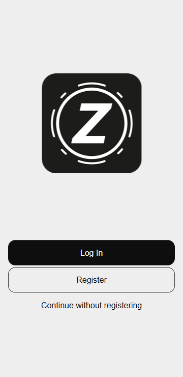

# Доступ без регистрации

Функция «Продолжить без регистрации» позволяет пользователям временно пользоваться **Zennio Remote** без создания аккаунта и входа в систему.

## Как это работает?

На главном экране приложения, под кнопками «Войти» и «Зарегистрироваться», находится опция «Продолжить без регистрации». При её выборе автоматически создаётся временная учётная запись, которая даёт временный доступ к приложению.

<figure markdown>
{ width="200" loading=lazy }
</figure>

## Важные моменты

- В этом режиме создаётся временная учётная запись, которая будет удалена при выходе из системы.
- Функция голосового управления недоступна с временной учётной записью.

!!! Info "Информация"
    Доступ без регистрации предназначен для немедленного использования. Если вам нужен постоянный доступ, сохранение определённых настроек или использование расширенных функций, таких как голосовое управление, рекомендуется создать аккаунт или войти в существующую учётную запись.

------

- 

    [:octicons-arrow-left-24: Войти в систему](/zr-manual-ru/access_register/login)

- 

    
    [Сопряжение устройства :octicons-arrow-right-24:](/zr-manual-ru//devices/device_pairing)

