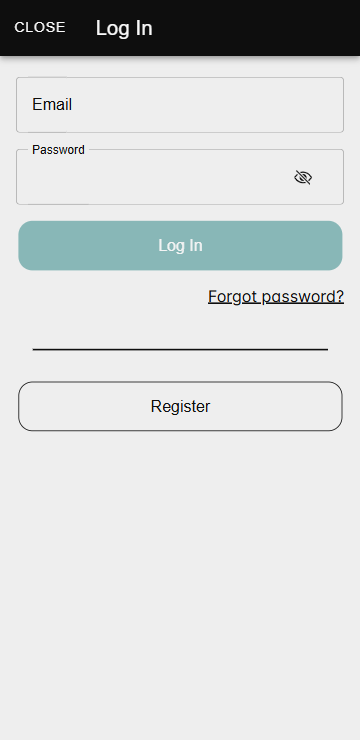
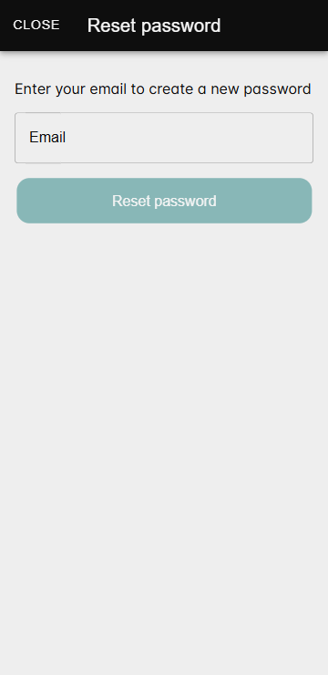
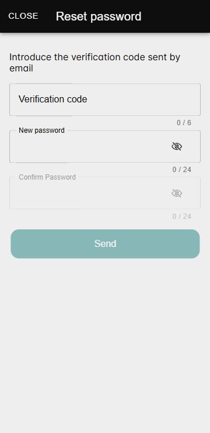

# Войти в систему

Функция **Войти в систему** позволяет пользователям получить доступ к **Zennio Remote Manager** с помощью своих учётных данных. Она также включает опцию восстановления пароля.

## Доступ к окну входа в систему

На главном экране приложения отображаются две основные кнопки: **Войти** и **Зарегистрироваться**.

Чтобы войти, пользователь должен нажать на кнопку **Войти**, после чего откроется следующее окно:

## Обязательные поля

- **Адрес электронной почты**: Должен совпадать с адресом, указанным при регистрации.
- **Пароль**: Пароль, настроенный при регистрации.

!!! info "Информация"
    Если адрес электронной почты не подтверждён, войти в приложение будет невозможно.

## Восстановление пароля

Если пользователь забыл пароль, он должен нажать на опцию **Забыли пароль?** в окне входа. Это запустит пошаговый процесс восстановления пароля.

### Шаг 1: Введите адрес электронной почты

На первом экране процесса пользователь должен ввести адрес электронной почты, связанный с зарегистрированной учётной записью.

Если будет введён адрес, не связанный с учётной записью, появится сообщение об ошибке:

После того как будет введён действительный адрес, пользователю на почту будет отправлено письмо с числовым кодом.

### Шаг 2: Код и новый пароль

Пользователь должен ввести полученный код и установить новый пароль, который соответствует следующим требованиям:

- Не менее 8 символов.
- Содержит цифры, строчные и заглавные буквы.

После заполнения всех полей пользователь должен подтвердить диалог, чтобы обновить пароль.

!!! info "Информация"
    Если введённый код неверный или пароли не совпадают, приложение уведомит пользователя сообщением об ошибке.

------

- 
Назад

    [:octicons-arrow-left-24: Создание учётной записи](/zr-manual-ru/access_register/register/){ .md-button }

- 
Вперед
    
    [Доступ без регистрации :octicons-arrow-right-24:](/zr-manual-ru/access_register/guest_access/){ .md-button }

