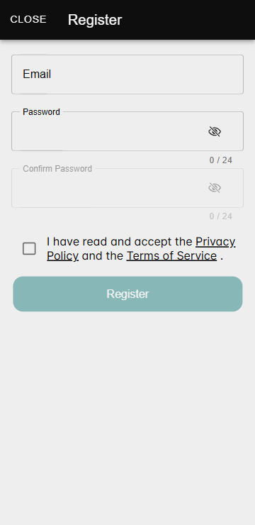

# Создание учётной записи

Функция «Создание учётной записи» позволяет пользователям зарегистрироваться в Zennio Remote, чтобы получить доступ ко всем возможностям приложения. Для завершения процесса необходимо подтверждение по электронной почте.

## Как открыть окно регистрации

На главном экране приложения отображаются две основные опции: **«Войти»** и **«Зарегистрироваться»**.

Чтобы создать учётную запись, пользователю необходимо нажать на кнопку **«Зарегистрироваться»**, после чего откроется окно регистрации.

<figure markdown>
{ width="200" loading=lazy }
</figure>

## Обязательные поля

- **Адрес электронной почты:** Должен быть действительным и ещё не зарегистрированным. Если адрес уже используется или недействителен, отобразится сообщение об ошибке.
- **Пароль:** Пароль должен соответствовать следующим требованиям:
  - Минимум 8 символов.
  - Содержать цифры, строчные и заглавные буквы.
- **Подтверждение пароля:** Повторите пароль, чтобы убедиться, что он совпадает с введённым ранее.

Кроме того, для завершения регистрации **обязательно** принять Политику конфиденциальности и Условия использования. Пользователь должен поставить соответствующую галочку, чтобы продолжить.

## Подтверждение учётной записи

После заполнения и отправки формы приложение автоматически отправит письмо с подтверждением на указанный адрес электронной почты. Это письмо содержит ссылку для подтверждения учётной записи.

Шаги для подтверждения учётной записи:

1. Проверьте папку «Входящие» на указанном адресе электронной почты (а также папку «Спам», если письма там нет).
2. Перейдите по ссылке, указанной в письме с подтверждением.

!!! info "Важно"

    Учётная запись будет неактивна до тех пор, пока адрес электронной почты не будет подтверждён. Без этого подтверждения войти в приложение будет невозможно. Ссылка, отправленная пользователю, действительна в течение 24 часов.

---

- 

    [:octicons-arrow-left-24: Установка](/zr-manual-ru/intro/install/)

- 

    
    [Войти в систему :octicons-arrow-right-24:](/zr-manual-ru/access_register/login/)

