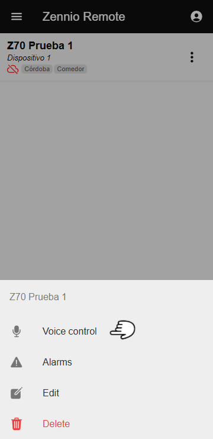
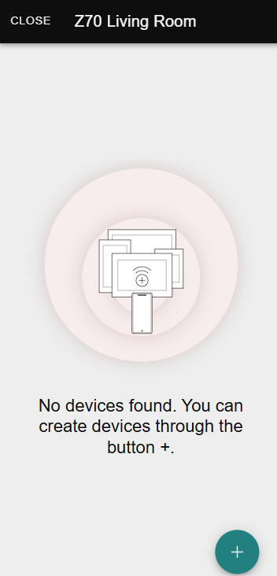
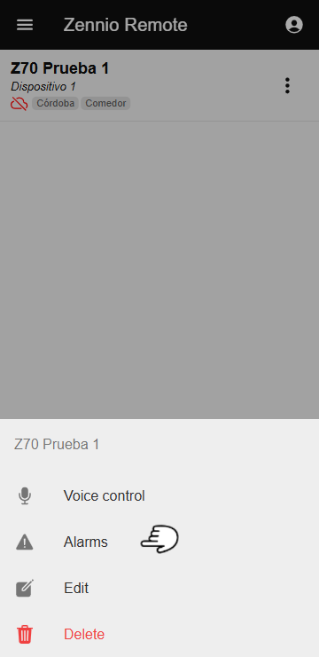
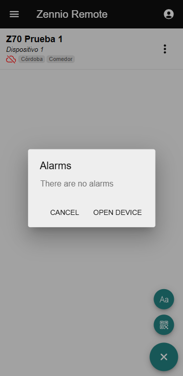
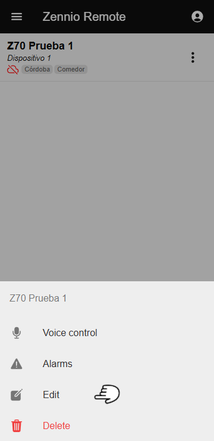
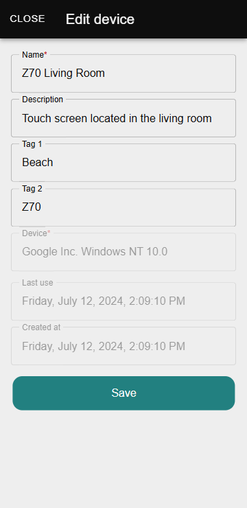
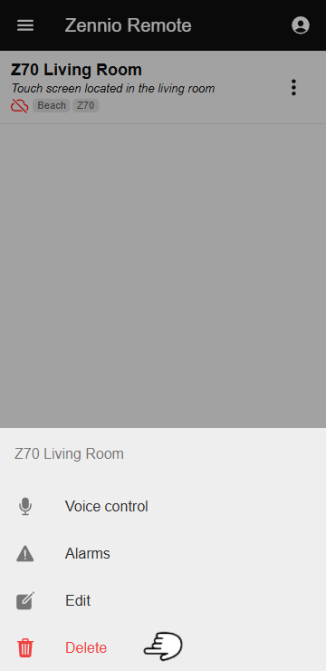
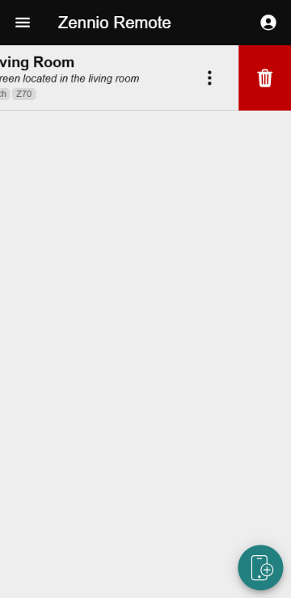

# Управление устройствами

Функция **Управление устройствами** позволяет пользователям выполнять определённые действия с подключёнными устройствами в приложении **Zennio Remote**. Ниже подробно описаны функции и опции, доступные через **Меню управления**.

------

## Голосовое управление

Позволяет настраивать и активировать голосовые команды на совместимых устройствах. Для использования этой функции важно убедиться, что:

- Устройство должно быть совместимо с голосовым управлением.
- Должна быть доступна соответствующая лицензия.

### Доступ к голосовому управлению

В списке устройств пользователь должен найти устройство, на котором хочет настроить голосовое управление. Нажав на три точки справа от устройства, он увидит несколько опций, включая **Голосовое управление**.

<figure markdown>
{ width="200" loading=lazy }
</figure>

После выбора опции **Голосовое управление** откроется окно, где можно настроить голосовые команды для выбранного устройства.

<figure markdown>
{ width="200" loading=lazy }
</figure>

------

## Активные тревоги

Позволяет просматривать и управлять активными тревогами, связанными с настроенными устройствами.

### Доступ к активным тревогам

В списке устройств пользователь должен найти устройство, для которого хочет проверить активные тревоги. Нажав на три точки справа от устройства, он увидит несколько опций, включая **Тревоги**.

<figure markdown>
{ width="200" loading=lazy }
</figure>

После выбора опции **Тревоги** откроется окно, где будет отображаться сводка активных тревог, связанных с устройством. В окне есть кнопка **Открыть устройство**, которая открывает удалённое управление устройством.

<figure markdown>
{ width="200" loading=lazy }
</figure>

------

## Редактировать устройство

Позволяет изменять свойства устройства.

### Доступ к редактированию устройства

В списке устройств пользователь должен найти устройство, которое хочет отредактировать. Нажав на три точки справа от устройства, он увидит несколько опций, включая **Редактировать**.

<figure markdown>
{ width="200" loading=lazy }
</figure>

После выбора опции **Редактировать** откроется окно, где можно изменить свойства устройства, в том числе:

- **Имя:** Пользовательский идентификатор устройства.
- **Описание:** Дополнительная информация об устройстве.
- **Теги:** Ключевые слова для облегчения поиска и категоризации.

<figure markdown>
{ width="200" loading=lazy }
</figure>

------

## Удалить устройство

Позволяет отвязать устройство от приложения.

### Способы удаления устройства

Есть два основных способа удалить устройство из приложения:

- **Из Меню управления:**
    - Выбрать опцию **Удалить**.
    - Подтвердить действие.

<figure markdown>
{ width="200" loading=lazy }
</figure>

- **Из Списка устройств:**
    - Провести по строке с устройством влево, чтобы появился значок удаления.
    - Нажать на значок и подтвердить.

<figure markdown>
{ width="200" loading=lazy }
</figure>

!!! Info "Информация"
    После удаления устройство перестанет быть доступным из приложения, хотя его можно будет повторно подключить в будущем.

------

- 
Назад

    [:octicons-arrow-left-24: Список устройств](/zr-manual-ru/devices/list_devices/){ .md-button }

- 
Вперед
  
    [Управление несколькими устройствами :octicons-arrow-right-24:](/zr-manual-ru/devices/multiple_devices_management/){ .md-button }

