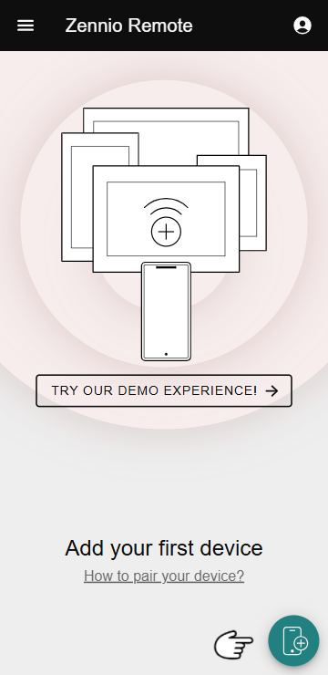
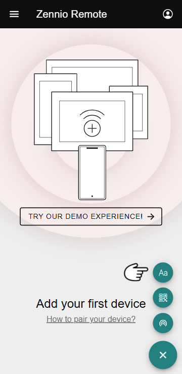
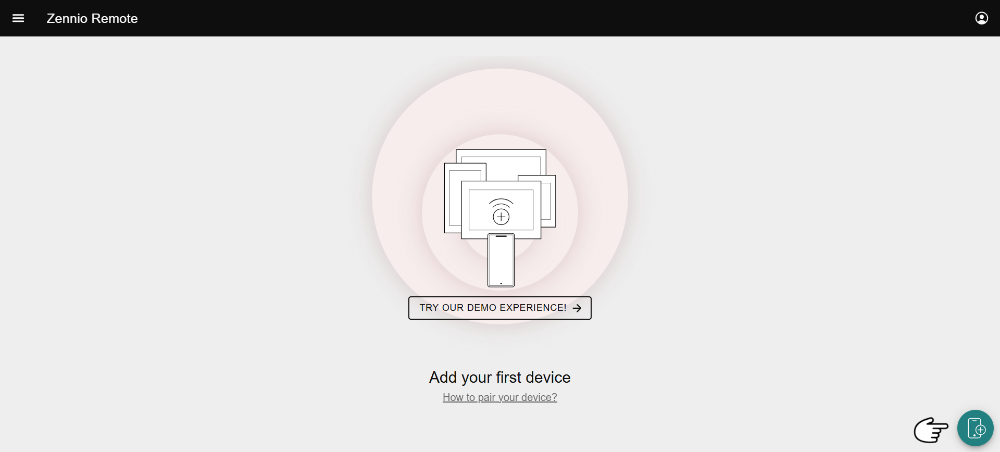
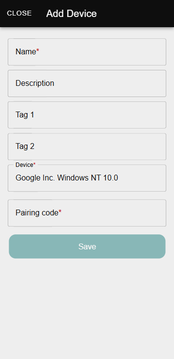
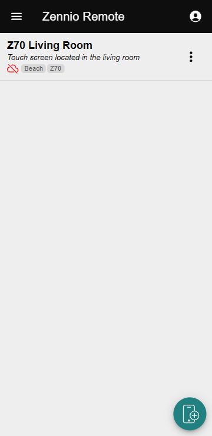
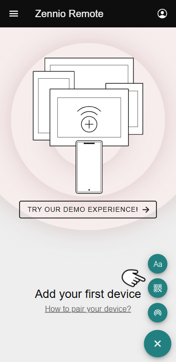
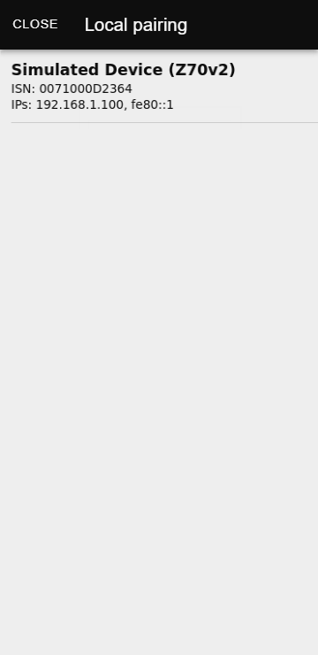
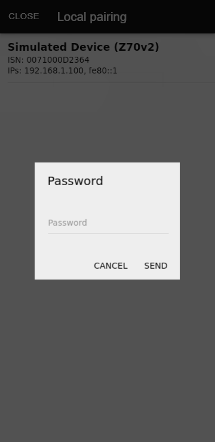

# Как выполнить сопряжение устройства?

Функция сопряжения устройств позволяет пользователям добавлять устройства в приложение **Zennio Remote**. Ниже представлено пошаговое руководство по сопряжению устройства из веб-версии и мобильного приложения.

------

## Получение кода сопряжения

Код сопряжения необходимо получить с самого устройства. Чтобы получить код, обратитесь к руководству пользователя устройства:

- [Z41 Pro](https://knx-trade.ru/zennio-touch-panels/4-zvi-z41pro.html), [Z41 COM](https://knx-trade.ru/zennio-touch-panels/1-zvi-z41com.html): [Руководство пользователя](https://www.zennio.com/documents/manual_z41_lite_pro_com_en)
- [Z50](https://knx-trade.ru/zennio-touch-panels/2-zviz50.html), [Z70](https://knx-trade.ru/zennio-touch-panels/578-zviz70v2.html), [Z100](https://knx-trade.ru/zennio-touch-panels/3-zviz100.html): [Руководство пользователя](https://www.zennio.com/documents/manual_z50-z70_v2-z100_en)

!!! Info "Информация"
    - По умолчанию код сопряжения действует 2 минуты, но может быть настроен интегратором. По истечении этого времени код станет недействительным, и потребуется сгенерировать новый.
    - С одной учётной записью можно выполнить сопряжение до 90 разных сенсорных панелей.
    - Одна сенсорная панель может быть сопряжена с 49 учётными записями или приложениями.

------

## Сопряжение с помощью буквенно-цифрового кода

{==

  Веб-версия / Android/iOS

==}

Чтобы выполнить сопряжение устройства с помощью буквенно-цифрового кода, выполните следующие шаги.

### Шаг 1: Доступ к странице сопряжения

=== "Android/iOS"

    Пользователь должен нажать на кнопку <svg xmlns="http://www.w3.org/2000/svg" viewBox="0 0 53.78 53.78" width="20" height="20"><path fill="none" d="M40.1 20.025a11.535 11.535 0 1 0 11.54 11.53 11.543 11.543 0 0 0-11.54-11.53m6.53 12.53H41.1v5.53a1 1 0 0 1-2 0v-5.53h-5.53a1 1 0 0 1 0-2h5.53v-5.53a1 1 0 0 1 2 0v5.53h5.53a1 1 0 0 1 0 2"></path><path fill="none" d="M26.57 31.555A13.54 13.54 0 0 1 39.1 18.076V7.435a4.506 4.506 0 0 0-4.52-4.48h-20.6a4.5 4.5 0 0 0-4.51 4.48v39.48a4.5 4.5 0 0 0 4.51 4.48h20.6a4.506 4.506 0 0 0 4.52-4.48v-1.871a13.545 13.545 0 0 1-12.53-13.489M19.087 8.1a1 1 0 0 1 1-1h8.393a1 1 0 0 1 0 2h-8.393a1 1 0 0 1-1-1m5.2 40.665a2.839 2.839 0 1 1 2.835-2.839 2.844 2.844 0 0 1-2.834 2.841Z"></path><path fill="currentColor" stroke="currentColor" d="M24.288 43.09a2.839 2.839 0 1 0 2.835 2.838 2.84 2.84 0 0 0-2.835-2.838ZM29.48 8.1a1 1 0 0 0-1-1h-8.393a1 1 0 0 0 0 2h8.393a1 1 0 0 0 1-1Z"></path><path fill="currentColor" stroke="currentColor" d="M41.1 18.076V7.435a6.51 6.51 0 0 0-6.52-6.48h-20.6a6.5 6.5 0 0 0-6.51 6.48v39.48a6.5 6.5 0 0 0 6.51 6.48h20.6a6.51 6.51 0 0 0 6.52-6.48v-1.871a13.52 13.52 0 0 0 0-26.968ZM34.58 51.4h-20.6a4.5 4.5 0 0 1-4.51-4.48V7.435a4.5 4.5 0 0 1 4.51-4.48h20.6a4.506 4.506 0 0 1 4.52 4.48v10.641a13.52 13.52 0 0 0 0 26.968v1.871a4.506 4.506 0 0 1-4.52 4.485Zm5.52-8.3a11.535 11.535 0 1 1 11.54-11.54A11.55 11.55 0 0 1 40.1 43.1Z"></path><path fill="currentColor" stroke="currentColor" d="M46.63 30.555H41.1v-5.53a1 1 0 0 0-2 0v5.53h-5.53a1 1 0 0 0 0 2h5.53v5.53a1 1 0 0 0 2 0v-5.53h5.53a1 1 0 0 0 0-2Z"></path></svg>, расположенную в правом нижнем углу списка устройств, а затем выбрать опцию **Pairing with alphanumeric code**.

    Нажмите на кнопку <svg stroke="currentColor" fill="currentColor" stroke-width="0" viewBox="0 0 256 256" height="1em" width="1em" xmlns="http://www.w3.org/2000/svg"><path d="M90.86,50.89a12,12,0,0,0-21.72,0l-64,136a12,12,0,0,0,21.71,10.22L42.44,164h75.12l15.58,33.11a12,12,0,0,0,21.72-10.22ZM53.74,140,80,84.18,106.27,140ZM200,84c-13.85,0-24.77,3.86-32.45,11.48a12,12,0,1,0,16.9,17c3-3,8.26-4.52,15.55-4.52,11,0,20,7.18,20,16v4.39A47.28,47.28,0,0,0,200,124c-24.26,0-44,17.94-44,40s19.74,40,44,40a47.18,47.18,0,0,0,22-5.38A12,12,0,0,0,244,192V124C244,101.94,224.26,84,200,84Zm0,96c-11,0-20-7.18-20-16s9-16,20-16,20,7.18,20,16S211,180,200,180Z"></path></svg> (**Add device**) в правом верхнем углу.

    { width="200" loading=lazy } { width="200" loading=lazy }

=== "Веб-версия"

    Пользователь должен нажать на кнопку <svg xmlns="http://www.w3.org/2000/svg" viewBox="0 0 53.78 53.78" width="20" height="20"><path fill="none" d="M40.1 20.025a11.535 11.535 0 1 0 11.54 11.53 11.543 11.543 0 0 0-11.54-11.53m6.53 12.53H41.1v5.53a1 1 0 0 1-2 0v-5.53h-5.53a1 1 0 0 1 0-2h5.53v-5.53a1 1 0 0 1 2 0v5.53h5.53a1 1 0 0 1 0 2"></path><path fill="none" d="M26.57 31.555A13.54 13.54 0 0 1 39.1 18.076V7.435a4.506 4.506 0 0 0-4.52-4.48h-20.6a4.5 4.5 0 0 0-4.51 4.48v39.48a4.5 4.5 0 0 0 4.51 4.48h20.6a4.506 4.506 0 0 0 4.52-4.48v-1.871a13.545 13.545 0 0 1-12.53-13.489M19.087 8.1a1 1 0 0 1 1-1h8.393a1 1 0 0 1 0 2h-8.393a1 1 0 0 1-1-1m5.2 40.665a2.839 2.839 0 1 1 2.835-2.839 2.844 2.844 0 0 1-2.834 2.841Z"></path><path fill="currentColor" stroke="currentColor" d="M24.288 43.09a2.839 2.839 0 1 0 2.835 2.838 2.84 2.84 0 0 0-2.835-2.838ZM29.48 8.1a1 1 0 0 0-1-1h-8.393a1 1 0 0 0 0 2h8.393a1 1 0 0 0 1-1Z"></path><path fill="currentColor" stroke="currentColor" d="M41.1 18.076V7.435a6.51 6.51 0 0 0-6.52-6.48h-20.6a6.5 6.5 0 0 0-6.51 6.48v39.48a6.5 6.5 0 0 0 6.51 6.48h20.6a6.51 6.51 0 0 0 6.52-6.48v-1.871a13.52 13.52 0 0 0 0-26.968ZM34.58 51.4h-20.6a4.5 4.5 0 0 1-4.51-4.48V7.435a4.5 4.5 0 0 1 4.51-4.48h20.6a4.506 4.506 0 0 1 4.52 4.48v10.641a13.52 13.52 0 0 0 0 26.968v1.871a4.506 4.506 0 0 1-4.52 4.485Zm5.52-8.3a11.535 11.535 0 1 1 11.54-11.54A11.55 11.55 0 0 1 40.1 43.1Z"></path><path fill="currentColor" stroke="currentColor" d="M46.63 30.555H41.1v-5.53a1 1 0 0 0-2 0v5.53h-5.53a1 1 0 0 0 0 2h5.53v5.53a1 1 0 0 0 2 0v-5.53h5.53a1 1 0 0 0 0-2Z"></path></svg>, расположенную в правом нижнем углу списка устройств.

    { width="600" loading=lazy }

### Шаг 2: Заполнение формы сопряжения

После нажатия кнопки откроется следующее окно:

{ width="200" loading=lazy }

Здесь необходимо заполнить следующие поля:

- **Device Name (Имя устройства):** Имя, под которым устройство будет отображаться в списке.
- **Description (optional) (Описание (необязательно)):** Дополнительная информация об устройстве.
- **Tag 1 (optional) (Тег 1 (необязательно)):** Дополнительный тег для упрощения поиска, если сопряжено несколько устройств.
- **Tag 2 (optional) (Тег 2 (необязательно)):** Второй тег для поиска.
- **Device (Устройство):** Описание сопрягаемого устройства. Это поле автоматически заполняется информацией о текущей модели, но его можно отредактировать.
- **Pairing Code (Код сопряжения):** 9-символьный буквенно-цифровой код, который необходимо получить с сопрягаемого устройства.

После сохранения изменений устройство синхронизируется с приложением и появится в списке устройств.

{ width="200" loading=lazy }

------

## Сопряжение с помощью QR-кода

{==

Android/iOS

==}

Чтобы начать сопряжение с помощью QR-кода, выполните следующие действия:

### Шаг 1: Доступ к опции сопряжения

Пользователь должен нажать на кнопку <svg xmlns="http://www.w3.org/2000/svg" viewBox="0 0 53.78 53.78" width="20" height="20"><path fill="none" d="M40.1 20.025a11.535 11.535 0 1 0 11.54 11.53 11.543 11.543 0 0 0-11.54-11.53m6.53 12.53H41.1v5.53a1 1 0 0 1-2 0v-5.53h-5.53a1 1 0 0 1 0-2h5.53v-5.53a1 1 0 0 1 2 0v5.53h5.53a1 1 0 0 1 0 2"></path><path fill="none" d="M26.57 31.555A13.54 13.54 0 0 1 39.1 18.076V7.435a4.506 4.506 0 0 0-4.52-4.48h-20.6a4.5 4.5 0 0 0-4.51 4.48v39.48a4.5 4.5 0 0 0 4.51 4.48h20.6a4.506 4.506 0 0 0 4.52-4.48v-1.871a13.545 13.545 0 0 1-12.53-13.489M19.087 8.1a1 1 0 0 1 1-1h8.393a1 1 0 0 1 0 2h-8.393a1 1 0 0 1-1-1m5.2 40.665a2.839 2.839 0 1 1 2.835-2.839 2.844 2.844 0 0 1-2.834 2.841Z"></path><path fill="currentColor" stroke="currentColor" d="M24.288 43.09a2.839 2.839 0 1 0 2.835 2.838 2.84 2.84 0 0 0-2.835-2.838ZM29.48 8.1a1 1 0 0 0-1-1h-8.393a1 1 0 0 0 0 2h8.393a1 1 0 0 0 1-1Z"></path><path fill="currentColor" stroke="currentColor" d="M41.1 18.076V7.435a6.51 6.51 0 0 0-6.52-6.48h-20.6a6.5 6.5 0 0 0-6.51 6.48v39.48a6.5 6.5 0 0 0 6.51 6.48h20.6a6.51 6.51 0 0 0 6.52-6.48v-1.871a13.52 13.52 0 0 0 0-26.968ZM34.58 51.4h-20.6a4.5 4.5 0 0 1-4.51-4.48V7.435a4.5 4.5 0 0 1 4.51-4.48h20.6a4.506 4.506 0 0 1 4.52 4.48v10.641a13.52 13.52 0 0 0 0 26.968v1.871a4.506 4.506 0 0 1-4.52 4.485Zm5.52-8.3a11.535 11.535 0 1 1 11.54-11.54A11.55 11.55 0 0 1 40.1 43.1Z"></path><path fill="currentColor" stroke="currentColor" d="M46.63 30.555H41.1v-5.53a1 1 0 0 0-2 0v5.53h-5.53a1 1 0 0 0 0 2h5.53v5.53a1 1 0 0 0 2 0v-5.53h5.53a1 1 0 0 0 0-2Z"></path></svg> в правом нижнем углу списка устройств.

{ width="200" loading=lazy }

После нажатия на кнопку следующим шагом будет выбор опции **Pairing with QR code** <svg stroke="currentColor" fill="currentColor" stroke-width="0" viewBox="0 0 512 512" height="1em" width="1em" xmlns="http://www.w3.org/2000/svg"><path d="M336 336h80v80h-80zm-64-64h64v64h-64zm144 144h64v64h-64zm16-144h48v48h-48zM272 432h48v48h-48zm64-336h80v80h-80z"></path><path d="M480 240H272V32h208zm-164-44h120V76H316zM96 96h80v80H96z"></path><path d="M240 240H32V32h208zM76 196h120V76H76zm20 140h80v80H96z"></path><path d="M240 480H32V272h208zM76 436h120V316H76z"></path></svg>.

{ width="200" loading=lazy }

### Шаг 2: Сканирование QR-кода

Камера устройства откроется автоматически. Пользователь должен навести камеру на QR-код, сгенерированный на экране устройства, которое нужно сопрячь. Процесс сопряжения произойдёт автоматически.

!!! Info "Информация"
    - Сопряжение с помощью QR-кода недоступно для устройств Z41.

------

## Сопряжение с помощью локального обнаружения

{==

Android/iOS

==}

Эта функция позволяет автоматически обнаруживать совместимые устройства в той же локальной сети без необходимости вручную вводить буквенно-цифровой код или сканировать QR-код.

!!! Info "Информация"
    - Для этого типа сопряжения необходимо знать пароль сопряжения устройства. Для получения дополнительной информации обратитесь к руководству пользователя устройств: 
        - **Z50, Z70, Z100**: [Руководство пользователя](https://www.zennio.com/documents/manual_z50-z70_v2-z100_en) 
        - **Remote Box**: [Руководство пользователя](https://www.zennio.com/documents/manual_remotebox_en)
    - Этот тип сопряжения доступен только для устройств: [Z50](https://knx-trade.ru/zennio-touch-panels/2-zviz50.html), [Z70](https://knx-trade.ru/zennio-touch-panels/578-zviz70v2.html), [Z100](https://knx-trade.ru/zennio-touch-panels/3-zviz100.html) и [Remote Box](https://knx-trade.ru/zennio-system/736-zsyrbox.html)

### Шаг 1: Доступ к опции локального сопряжения

Пользователь должен нажать на кнопку <svg xmlns="http://www.w3.org/2000/svg" viewBox="0 0 53.78 53.78" width="20" height="20"><path fill="none" d="M40.1 20.025a11.535 11.535 0 1 0 11.54 11.53 11.543 11.543 0 0 0-11.54-11.53m6.53 12.53H41.1v5.53a1 1 0 0 1-2 0v-5.53h-5.53a1 1 0 0 1 0-2h5.53v-5.53a1 1 0 0 1 2 0v5.53h5.53a1 1 0 0 1 0 2"></path><path fill="none" d="M26.57 31.555A13.54 13.54 0 0 1 39.1 18.076V7.435a4.506 4.506 0 0 0-4.52-4.48h-20.6a4.5 4.5 0 0 0-4.51 4.48v39.48a4.5 4.5 0 0 0 4.51 4.48h20.6a4.506 4.506 0 0 0 4.52-4.48v-1.871a13.545 13.545 0 0 1-12.53-13.489M19.087 8.1a1 1 0 0 1 1-1h8.393a1 1 0 0 1 0 2h-8.393a1 1 0 0 1-1-1m5.2 40.665a2.839 2.839 0 1 1 2.835-2.839 2.844 2.844 0 0 1-2.834 2.841Z"></path><path fill="currentColor" stroke="currentColor" d="M24.288 43.09a2.839 2.839 0 1 0 2.835 2.838 2.84 2.84 0 0 0-2.835-2.838ZM29.48 8.1a1 1 0 0 0-1-1h-8.393a1 1 0 0 0 0 2h8.393a1 1 0 0 0 1-1Z"></path><path fill="currentColor" stroke="currentColor" d="M41.1 18.076V7.435a6.51 6.51 0 0 0-6.52-6.48h-20.6a6.5 6.5 0 0 0-6.51 6.48v39.48a6.5 6.5 0 0 0 6.51 6.48h20.6a6.51 6.51 0 0 0 6.52-6.48v-1.871a13.52 13.52 0 0 0 0-26.968ZM34.58 51.4h-20.6a4.5 4.5 0 0 1-4.51-4.48V7.435a4.5 4.5 0 0 1 4.51-4.48h20.6a4.506 4.506 0 0 1 4.52 4.48v10.641a13.52 13.52 0 0 0 0 26.968v1.871a4.506 4.506 0 0 1-4.52 4.485Zm5.52-8.3a11.535 11.535 0 1 1 11.54-11.54A11.55 11.55 0 0 1 40.1 43.1Z"></path><path fill="currentColor" stroke="currentColor" d="M46.63 30.555H41.1v-5.53a1 1 0 0 0-2 0v5.53h-5.53a1 1 0 0 0 0 2h5.53v5.53a1 1 0 0 0 2 0v-5.53h5.53a1 1 0 0 0 0-2Z"></path></svg> в правом нижнем углу списка устройств.

{ width="200" loading=lazy }

После нажатия на кнопку следующим шагом будет выбор опции <svg stroke="currentColor" fill="currentColor" stroke-width="0" viewBox="0 0 512 512" height="1em" width="1em" xmlns="http://www.w3.org/2000/svg"><path d="M256 228.719c-22.879 0-41.597 18.529-41.597 41.18 0 22.652 18.718 41.182 41.597 41.182 22.878 0 41.597-18.529 41.597-41.182 0-22.651-18.719-41.18-41.597-41.18zm124.8 41.179c0-67.946-56.163-123.539-124.8-123.539s-124.8 55.593-124.8 123.539c0 45.303 24.961 85.447 62.396 107.072l20.807-36.032c-24.972-14.417-41.604-40.153-41.604-71.04 0-45.295 37.433-82.358 83.201-82.358 45.771 0 83.201 37.063 83.201 82.358 0 30.887-16.633 56.623-41.604 71.04l20.807 36.032c37.433-21.624 62.396-61.769 62.396-107.072zM256 64C141.597 64 48 156.654 48 269.898 48 346.085 89.592 411.968 152 448l20.799-36.032c-49.919-28.824-83.207-81.324-83.207-142.069 0-90.593 74.891-164.718 166.408-164.718 91.517 0 166.406 74.125 166.406 164.718 0 60.745-33.284 114.271-83.205 142.069L360 448c62.406-36.032 104-101.915 104-178.102C464 156.654 370.403 64 256 64z"></path></svg> **Local Discovery**.

{ width="200" loading=lazy }

На этом этапе приложение автоматически начнёт сканирование локальной сети.

!!! Info "Информация"
    - Очень важно, чтобы мобильное устройство было подключено по Wi-Fi к той же сети, что и сопрягаемое устройство. 

### Шаг 2: Выбор устройства для сопряжения

Приложение отобразит список совместимых устройств, доступных в той же локальной сети:

{ width="200" loading=lazy }

Затем пользователь должен выбрать устройство, которое он хочет сопрячь, и ввести пароль сопряжения:

{ width="200" loading=lazy }

Если пароль верен, устройство сопряжётся автоматически и появится в списке устройств.

------

## Возможные сообщения об ошибках

Ниже приведены возможные сообщения об ошибках, которые могут появиться в процессе сопряжения, и их описания.

| Сообщение об ошибке                                          | Описание                                                     |
| ------------------------------------------------------------ | ------------------------------------------------------------ |
| **Pairing already exists** (Сопряжение уже существует)       | Устройство уже сопряжено с учётной записью.                  |
| **Pairing code has expired** (Срок действия кода сопряжения истёк) | Срок действия кода сопряжения истёк. Для продолжения процесса сопряжения необходимо сгенерировать новый код. |
| **Invalid pairing code** (Неверный код сопряжения)           | Введённый код сопряжения недействителен. Необходимо проверить код и ввести его снова. |
| **User pairing limit reached** (Достигнут лимит сопряжения для пользователя) | Пользователь достиг максимального количества устройств, которые могут быть сопряжены с его учётной записью. Перед сопряжением нового устройства необходимо отменить сопряжение с одним из старых. |
| **Device pairing limit reached** (Достигнут лимит сопряжения для устройства) | Устройство достигло максимального количества разрешённых сопряжений. Чтобы сопрячь его с новой учётной записью, необходимо отменить сопряжение с предыдущей. |
| **Incorrect password** (Неверный пароль)                     | Введён неверный пароль. Его необходимо проверить и ввести правильно. |
| **Remote control disabled** (Дистанционное управление отключено) | На устройстве отключено дистанционное управление.            |
| **Remote control without license** (Дистанционное управление без лицензии) | Устройство не имеет активной лицензии на использование функции дистанционного управления. Для включения этой функции необходимо приобрести действующую лицензию. |

------

## Дополнительные действия

Для получения дополнительной информации о том, как управлять и настраивать сопряжённые устройства, ознакомьтесь со специальным разделом документации:

!!! info "Управление устройствами"
    Получите доступ к меню управления, чтобы настраивать, конфигурировать и обслуживать сопряжённые устройства.
    
    [Узнать больше](/zr-manual/devices/device_management/)

------

- 

    [:octicons-arrow-left-24: Доступ без регистрации](/zr-manual-ru/access_register/guest_access/)

- 

    
    [Список устройств :octicons-arrow-right-24:](/zr-manual-ru/devices/list_devices/)

