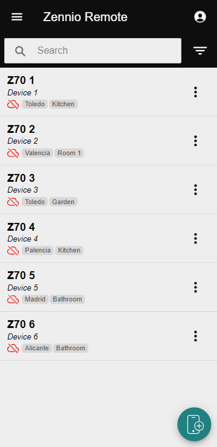
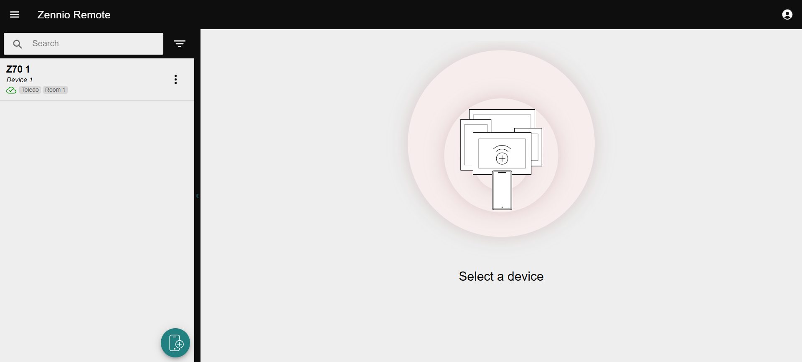
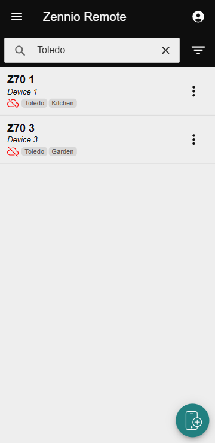
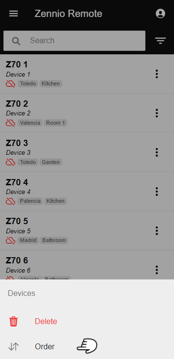
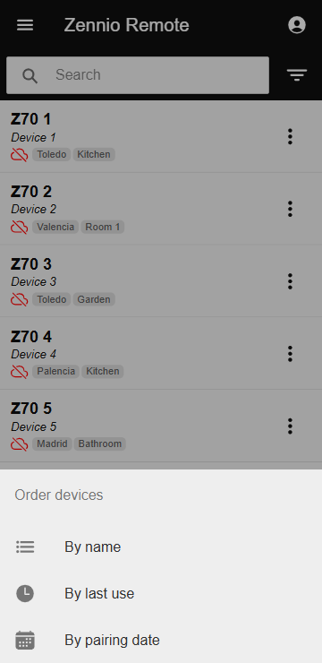
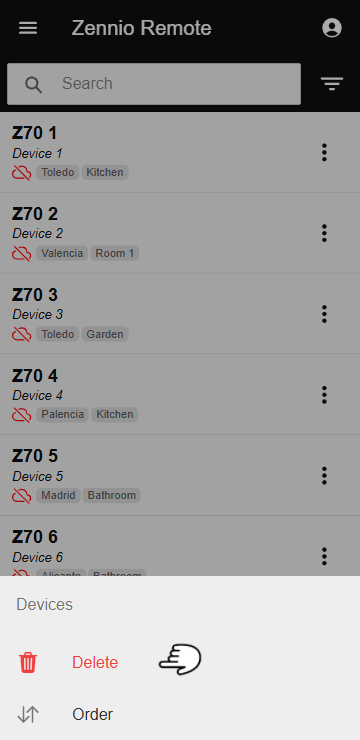
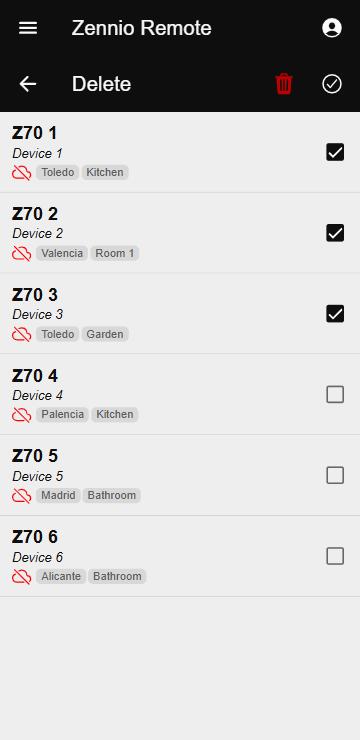

# Управление несколькими устройствами

Функция «**Управление несколькими устройствами**» (Managing Multiple Devices) предназначена для эффективной работы с большим количеством подключённых устройств в приложении **Zennio Remote**. Она предлагает следующие инструменты для оптимизации поиска, организации и удаления устройств.

------

## Поиск устройств

==Веб-версия== / ==Android/iOS==

Опция поиска помогает пользователям быстро находить устройства:

=== "Android/iOS"

    На устройствах с Android/iOS поиск активируется автоматически, если подключено более пяти устройств.

    <figure markdown>
    { width="200" loading=lazy }
    </figure>

=== "Веб-версия"

    В Интернете поиск доступен в любое время.

    <figure markdown>
    { width="600" loading=lazy }
    </figure>

Инструмент поиска позволяет фильтровать устройства по названию, описанию или тегам. Поиск нечувствителен к регистру.

<figure markdown>
{ width="200" loading=lazy }
</figure>

------

## Сортировка устройств

Подключённые устройства можно сортировать по следующим критериям:

- **По имени:** Сортировка в алфавитном порядке.
- **По последнему использованию:** Сортировка по дате последнего подключения.
- **По дате подключения:** Сортировка по дате подключения устройства.

### Как сортировать?

1. Нажмите на значок <svg stroke="currentColor" fill="currentColor" stroke-width="0" viewBox="0 0 512 512" height="1em" width="1em" xmlns="http://www.w3.org/2000/svg"><path d="M16 120h480v48H16zm80 112h320v48H96zm96 112h128v48H192z"></path></svg> в строке поиска.
2. Выберите **«Сортировать»**.
    <figure markdown>
    { width="200" loading=lazy }
    </figure>

3. Выберите желаемый критерий.
    <figure markdown>
    { width="200" loading=lazy }
    </figure>

!!! Info "Информация"
    Сортировка является временной и действует только для текущего сеанса.

------

## Удаление устройств

Опция удаления позволяет легко управлять сразу несколькими подключёнными устройствами:

### Как удалять?

1. Нажмите на значок <svg stroke="currentColor" fill="currentColor" stroke-width="0" viewBox="0 0 512 512" height="1em" width="1em" xmlns="http://www.w3.org/2000/svg"><path d="M16 120h480v48H16zm80 112h320v48H96zm96 112h128v48H192z"></path></svg> в строке поиска.
2. Выберите **«Удалить»**.
    <figure markdown>
    { width="200" loading=lazy }
    </figure>

3. Отметьте галочками устройства, которые нужно удалить (можно выбрать или снять выбор со всех устройств одновременно).
    <figure markdown>
    { width="200" loading=lazy }
    </figure>

4. Нажмите на значок <svg stroke="currentColor" fill="currentColor" stroke-width="0" viewBox="0 0 512 512" height="1em" width="1em" xmlns="http://www.w3.org/2000/svg" style="color: red;"><path fill="none" d="M296 64h-80a7.91 7.91 0 0 0-8 8v24h96V72a7.91 7.91 0 0 0-8-8z"></path><path d="M432 96h-96V72a40 40 0 0 0-40-40h-80a40 40 0 0 0-40 40v24H80a16 16 0 0 0 0 32h17l19 304.92c1.42 26.85 22 47.08 48 47.08h184c26.13 0 46.3-19.78 48-47l19-305h17a16 16 0 0 0 0-32zM192.57 416H192a16 16 0 0 1-16-15.43l-8-224a16 16 0 1 1 32-1.14l8 224A16 16 0 0 1 192.57 416zM272 400a16 16 0 0 1-32 0V176a16 16 0 0 1 32 0zm32-304h-96V72a7.91 7.91 0 0 1 8-8h80a7.91 7.91 0 0 1 8 8zm32 304.57A16 16 0 0 1 320 416h-.58A16 16 0 0 1 304 399.43l8-224a16 16 0 1 1 32 1.14z"></path></svg>, чтобы удалить выбранные устройства.
5. Подтвердите удаление.

!!! Info "Информация"
    После удаления устройства перестанут быть доступными, но их можно будет повторно подключить в будущем.

------

- 

    [:octicons-arrow-left-24: Управление устройствами](/zr-manual-ru/devices/device_management)

- 

  
    [Оповещения :octicons-arrow-right-24:](/zr-manual-ru/devices/notification)

