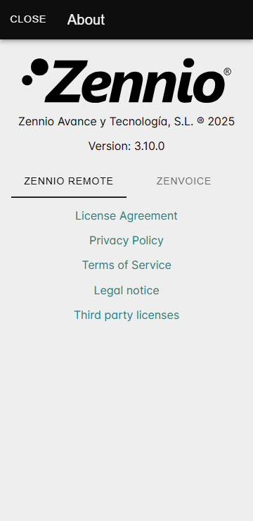
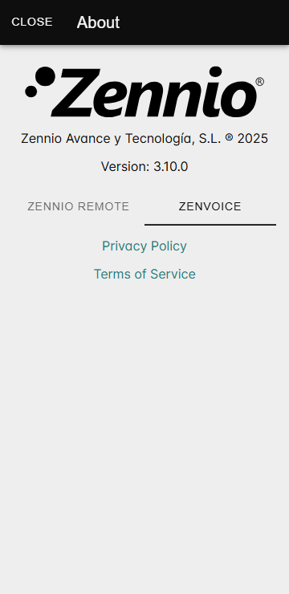

# О приложении

Раздел «О приложении» содержит подробную информацию о приложениях **Zennio Remote** и **ZenVoice**, а также юридические условия и положения, касающиеся их использования.

------

### Как открыть раздел «О приложении»

Чтобы перейти в этот раздел, пользователю необходимо:

  1. Нажать на меню, расположенное в левом верхнем углу экрана.
  2. Выбрать пункт **«О приложении»**.

------

## Доступная информация

Раздел «**О приложении**» содержит следующие пункты, разделённые по приложениям **Zennio Remote** и **ZenVoice**:

### Zennio Remote

  - **Версия приложения:** Текущая установленная версия **Zennio Remote**.
  - **Важные ссылки:**
    - Лицензионное соглашение
    - Политика конфиденциальности
    - Условия использования
    - Юридическая информация
    - Лицензии сторонних разработчиков

<figure markdown>
{ width="200" loading=lazy }
</figure>

### ZenVoice

  - **Версия приложения:** Текущая установленная версия **ZenVoice**.
  - **Важные ссылки:**
    - Политика конфиденциальности
    - Условия использования

<figure markdown>
{ width="200" loading=lazy }  
</figure>

------

### Контекстные ссылки

Ссылки на Лицензионное соглашение, Политику конфиденциальности и Условия использования доступны только тем пользователям, которые вошли в систему под своей учётной записью. Выбрав эти ссылки, пользователь сможет просмотреть содержимое, с которым он ранее согласился.

------

- 

    [:octicons-arrow-left-24: Помощь](/help/)

- 

  
    [О переводе :octicons-arrow-right-24:](/help/translation/)

