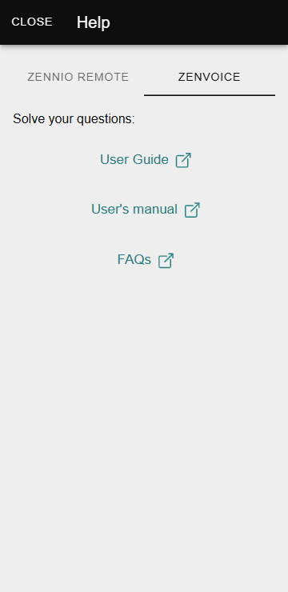

# Help

The **Help** section of the **Zennio Remote** app provides access to essential resources for resolving questions.

------

## Access the Help Window

To access the Help window, the user must:

1. Click on the menu located in the upper left corner of the screen.
2. Select the **Help** option.

------

## Available Content

Inside the **Help** window,, the user will find the following sections, divided between **Zennio Remote** and **ZenVoice**:

### Zennio Remote

- **Tutorial**:
  Provides access to an integrated pairing tutorial within the app.
- **User Manual**:
  The user is redirected to this manual, providing detailed information about the application's features.

### ZenVoice

- **User Guide**:
  Offers the option to download a detailed document that describes all of ZenVoice's features and usage.
- **User Manual**:
  The user is redirected to this manual, providing detailed information about the application's features.
- **FAQs**:
  Provides access to frequently asked questions related to the setup and use of ZenVoice.

