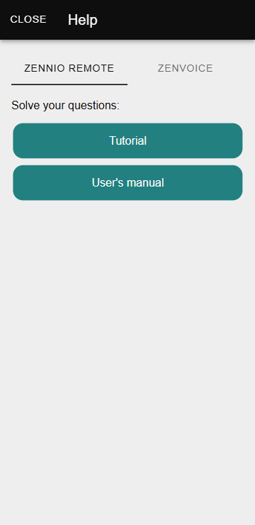
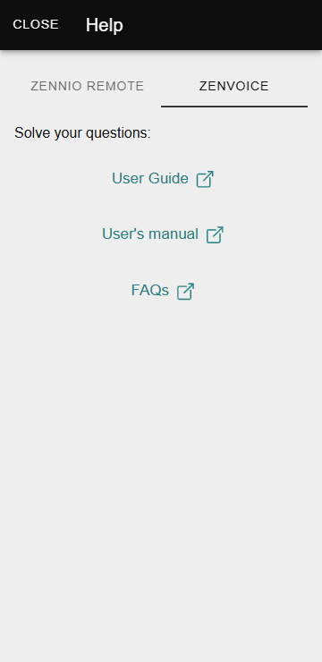

# Помощь

Раздел **Помощь** в приложении **Zennio Remote** предоставляет доступ к основным ресурсам для решения вопросов.

------

## Открытие окна «Помощь»

Чтобы открыть окно «Помощь», пользователю необходимо:

1. Нажать на меню, расположенное в верхнем левом углу экрана.
2. Выбрать опцию **«Помощь»**.

------

## Доступное содержимое

В окне **«Помощь»** пользователь найдёт следующие разделы, разделённые между **Zennio Remote** и **ZenVoice**:

### Zennio Remote

  - **Руководство**:
  
    Предоставляет доступ к встроенному в приложение руководству по сопряжению.

  - **Руководство пользователя**:

    Пользователь перенаправляется на это руководство, которое содержит подробную информацию о функциях приложения.

<figure markdown>
{ width="200" loading=lazy }
</figure>

### ZenVoice

  - **Руководство пользователя**:

    Предлагает возможность загрузить подробный документ, описывающий все функции и использование ZenVoice.
  
  - **Руководство пользователя**:
  
    Пользователь перенаправляется на это руководство, которое содержит подробную информацию о функциях приложения.
  
  - **Часто задаваемые вопросы (FAQs)**:  
  
    Предоставляет доступ к часто задаваемым вопросам, связанным с настройкой и использованием ZenVoice.

<figure markdown>
{ width="200" loading=lazy }
</figure>

### Проблематика

Существуют проблемы не завясящие от нас. Например официальные источники сообщают, что:

* **Amazon Web Services (AWS):** Сайты AWS, включая Amazon CloudFront, были заблокированы Роскомнадзором в России. Блокировка связана с невыполнением компаниями требований российского законодательства о "приземлении".
* **CDN (сети доставки контента):** В целом, использование CDN-сервисов не запрещено. Однако Роскомнадзор рекомендовал российским владельцам сайтов отказаться от использования некоторых иностранных CDN, например, Cloudflare, из-за внедрения технологий, которые могут обходить блокировки запрещённой информации.

Всё это может приводить к нестабильной работе системы, или полном отказе в обслуживании. Для решения этой проблемы [свяжитесь с нами](https://abasta.ru/helpdesk/1), мы постараемся найти решение.

