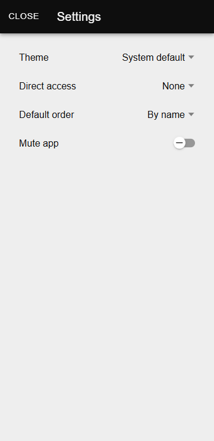

# Настройки

Раздел **«Настройки»** позволяет пользователям изменять различные параметры приложения **Zennio Remote**. Ниже приведены описания доступных опций для настройки интерфейса, функций и звуков.

------

## Доступ к окну настроек

Чтобы получить доступ к окну настроек, выполните следующие шаги:

   1. Нажмите на значок меню в левом верхнем углу приложения.
   2. Выберите опцию **«Настройки»**. Откроется следующее окно:
    <figure markdown>{ width="200" loading=lazy }</figure>

В этом окне можно управлять следующими параметрами.

------

## Изменение темы

Приложение **Zennio Remote** позволяет пользователям переключаться между различными темами оформления. Доступны следующие опции:

  - **Светлая:** Использует светлый интерфейс.
  - **Тёмная:** Использует тёмный интерфейс.
  - **Системная:** Автоматически адаптирует тему приложения к настройкам операционной системы устройства.

Чтобы изменить тему, просто выберите одну из опций в меню. Изменение будет применено немедленно.

------

## Прямой доступ

Опция **«Прямой доступ»** позволяет установить определённый экран в качестве устройства доступа по умолчанию. Это означает, что вместо отображения списка доступных устройств приложение будет напрямую открывать интерфейс выбранного устройства.

**Как настроить прямой доступ:**

  - В разделе **«Настройки»** выберите опцию **«Прямой доступ»**.
  - Выберите устройство, которое хотите установить по умолчанию.
  - Чтобы отключить эту функцию, выберите опцию **«Нет»**.

------

## Порядок по умолчанию

Опция **«Порядок по умолчанию»** позволяет задать критерии сортировки в списке подключённых экранов. Доступны следующие критерии:

  - **По имени:** Сортировка экранов в алфавитном порядке.
  - **По последнему использованию:** Сортировка на основе последнего подключения к каждому экрану.
  - **По дате подключения:** Сортировка экранов по дате их добавления в приложение.

Чтобы настроить эту опцию, выберите желаемый критерий в меню настроек.

------

## Отключить звук в приложении

Опция **«Отключить звук в приложении»** позволяет пользователям отключить звуки, издаваемые удалённым управлением.

Чтобы активировать или деактивировать эту функцию, просто используйте соответствующий переключатель в окне настроек.

!!! Info "Информация"
    Изменения, внесённые в **«Настройки»**, применяются немедленно и сохраняются в будущих сеансах, если пользователь не изменит их снова.

------

- 

    [:octicons-arrow-left-24: Пользователь](/zr-manual-ru/user_config/user/)

- 

  
    [Помощь :octicons-arrow-right-24:](/zr-manual-ru/help/)

