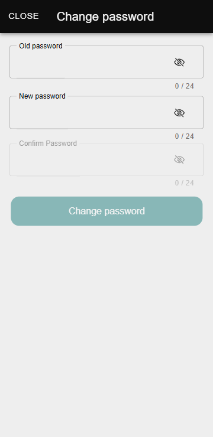
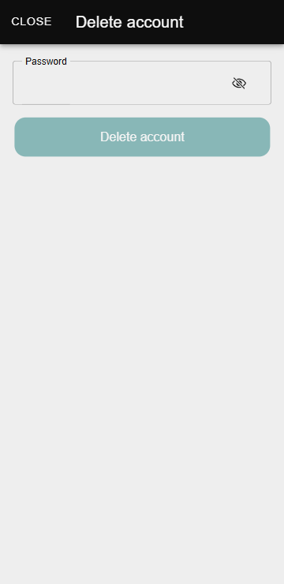

# Пользователь

Функция **«Пользователь»** позволяет управлять ключевыми аспектами личного аккаунта в приложении **Zennio Remote Manager**. В этом разделе пользователи могут совершать такие действия, как смена пароля, удаление аккаунта или выход из системы.

------

## Доступ к окну пользователя

Чтобы получить доступ к окну пользователя, выполните следующие шаги:

1.  Нажмите на значок <svg stroke="currentColor" fill="currentColor" stroke-width="0" viewBox="0 0 16 16" height="1em" width="1em" xmlns="http://www.w3.org/2000/svg"><path d="M11 6a3 3 0 1 1-6 0 3 3 0 0 1 6 0"></path><path fill-rule="evenodd" d="M0 8a8 8 0 1 1 16 0A8 8 0 0 1 0 8m8-7a7 7 0 0 0-5.468 11.37C3.242 11.226 4.805 10 8 10s4.757 1.225 5.468 2.37A7 7 0 0 0 8 1"></path></svg> в правом верхнем углу приложения.
2.  Откроется следующее окно:

Это окно отображает адрес электронной почты, связанный с пользователем, и предоставляет несколько опций для управления аккаунтом.

## Смена пароля

Чтобы сменить пароль, выполните следующие шаги:

1.  Нажмите на значок <svg stroke="currentColor" fill="currentColor" stroke-width="0" viewBox="0 0 576 512" height="1em" width="1em" xmlns="http://www.w3.org/2000/svg"><path d="M402.6 83.2l90.2 90.2c3.8 3.8 3.8 10 0 13.8L274.4 405.6l-92.8 10.3c-12.4 1.4-22.9-9.1-21.5-21.5l10.3-92.8L388.8 83.2c3.8-3.8 10-3.8 13.8 0zm162-22.9l-48.8-48.8c-15.2-15.2-39.9-15.2-55.2 0l-35.4 35.4c-3.8 3.8-3.8 10 0 13.8l90.2 90.2c3.8 3.8 10 3.8 13.8 0l35.4-35.4c15.2-15.3 15.2-40 0-55.2zM384 346.2V448H64V128h229.8c3.2 0 6.2-1.3 8.5-3.5l40-40c7.6-7.6 2.2-20.5-8.5-20.5H48C21.5 64 0 85.5 0 112v352c0 26.5 21.5 48 48 48h352c26.5 0 48-21.5 48-48V306.2c0-10.7-12.9-16-20.5-8.5l-40 40c-2.2 2.3-3.5 5.3-3.5 8.5z"></path></svg> рядом с полем пароля.
2.  Откроется следующее окно:
    <figure markdown>{ width="200" loading=lazy }</figure>
3.  Заполните поля формы:
      * **Старый пароль:** Введите текущий пароль.
      * **Новый пароль:** Укажите новый пароль, убедившись, что он соответствует следующим требованиям:
          * Не менее 8 символов.
          * Содержит цифры, строчные и заглавные буквы.
      * **Подтверждение пароля:** Повторно введите новый пароль для его проверки.
4.  Сохраните изменения.

!!! Info "Информация"
    Если новый пароль не соответствует требованиям или не совпадает с подтверждением, система уведомит пользователя об ошибке.

## Удаление аккаунта

Чтобы удалить аккаунт, выполните следующие шаги:

1.  Нажмите на кнопку **«Удалить аккаунт»** в главном окне пользователя.
2.  Откроется следующее окно:
        <figure markdown>{ width="200" loading=lazy }</figure>
3.  Введите пароль от аккаунта, чтобы подтвердить действие.
4.  Подтвердите действие.

!!! Warning "Внимание"
    **Предупреждение**: Удаление аккаунта необратимо. После завершения этого процесса весь доступ к связанным проектам и данным будет утерян.

## Выход из системы

Чтобы выйти из системы, нажмите на кнопку **«Выйти»** в главном окне пользователя.

------

После выполнения этого действия приложение перенаправит на главную страницу, где пользователи могут:

  * **Создание аккаунта:** [Узнайте, как зарегистрироваться на платформе и получить доступ ко всем её функциям.](/access_register/register)
  * **Вход в систему:** [Узнайте, как получить доступ к своему аккаунту и начать управлять своими устройствами.](/access_register/login)
  * **Доступ без регистрации:** [Узнайте, как пользоваться приложением без необходимости создавать аккаунт или входить в систему.](/access_register/guest_access)
