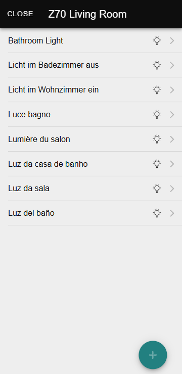
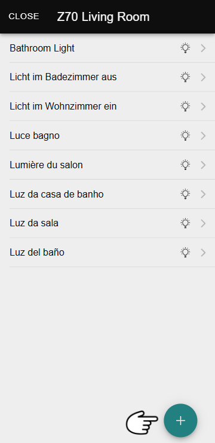
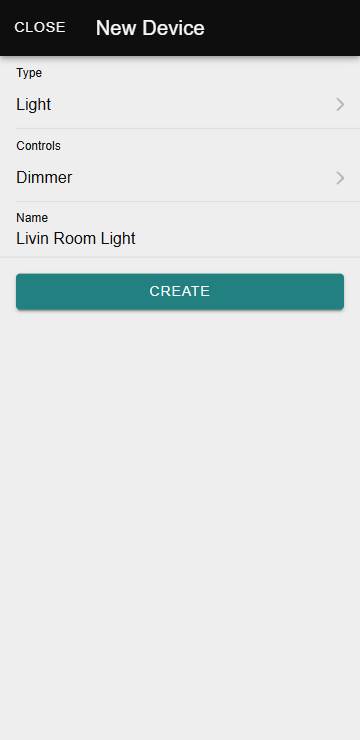
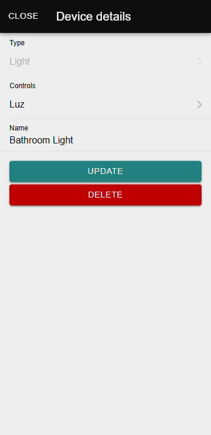

# Голосовое управление

Функция **«Голосовое управление»** позволяет интегрировать и управлять устройствами, совместимыми с голосовыми помощниками. Она предоставляет интуитивно понятный интерфейс для управления различными функциями умного дома с помощью голосовых команд.

Дополнительную информацию о доступе к этому разделу можно найти здесь:

!!! Abstract "Доступ к голосовому управлению:"
    Узнать, [как получить доступ к разделу «Голосовое управление»](/zr-manual-ru/devices/device_management#voice-control)

-----

## Список голосовых команд управления

В этом разделе отображаются объекты управления, настроенные в ZRCD, такие как освещение, жалюзи, климат и индикаторы.

<figure markdown>
{ width="200" loading=lazy }
</figure>

Дополнительную информацию о типах устройств можно найти в следующем разделе:

!!! Abstract "Типы устройств:"
    Узнать о [различных типах устройств, совместимых с голосовым управлением, и их особенностях](/zr-manual-ru/voice_control/device_types)

-----

## Создание устройств

Чтобы создать новое устройство, выполните следующие шаги:

  1.  Нажмите на значок **==+==**, чтобы начать создание устройства.
    <figure markdown>{ width="200" loading=lazy }</figure>

  2.  Введите следующую информацию:
    - **Тип устройства**.
    - **Элемент управления, настроенный в ZRCD**.
    - **Имя устройства в голосовых помощниках**.
    <figure markdown>{ width="200" loading=lazy }</figure>

  3.  Сохраните изменения, чтобы завершить регистрацию.

После создания устройство будет добавлено в список вместе с соответствующим значком его типа.

!!! Tip "Совет:"
    При выборе имени устройства учитывайте следующие рекомендации:

    - Убедитесь, что имя уникально, чтобы избежать путаницы.
    - Не используйте слова, связанные с названиями комнат или типами устройств, например, «кухня» или «свет».
    - Выберите правильный тип устройства, так как помощники будут использовать его для определения доступных действий.
    - Если помощник не распознаёт действия для устройства, которое должно быть совместимо, рекомендуется проверить имя и тип устройства, чтобы убедиться в их корректности.

-----

### Редактирование устройства

Чтобы отредактировать устройство, нажмите на него. Откроется диалоговое окно, где можно изменить следующую информацию:

- **Элемент управления, настроенный в ZRCD**.
- **Имя устройства в голосовых помощниках**.
    <figure markdown>{ width="200" loading=lazy }</figure>

### Удаление устройства

Чтобы удалить устройство, также нажмите на него, чтобы открыть диалоговое окно. Внутри этого окна вы найдёте опцию для удаления устройства.

Важно отметить, что удаление устройства в **ZenVoice** не обязательно приводит к его удалению из голосовых помощников, где оно настроено.

!!! Warning "Внимание:"
    Если конфигурация совместимого сенсорного экрана будет изменена или обновится его версия программного обеспечения, могут возникнуть ошибки голосового управления. Начиная с версии 3.6 совместимых сенсорных экранов, устройства, затронутые изменением конфигурации, будут автоматически удалены из голосовых помощников. Чтобы восстановить их, выполните следующие шаги:
    
    1.  Удалите элементы управления с сайта конфигурации **ZenVoice**.
    2.  Убедитесь, что они корректно удалены в приложениях-помощниках. Если автоматическое удаление не произошло, принудительно синхронизируйте (сделав свайп вниз на экране списка устройств).
    3.  Заново настройте элементы управления на сайте конфигурации **ZenVoice**.
    4.  Если новые элементы управления не появляются автоматически в приложениях, выполните ещё одну принудительную синхронизацию.
    
    Когда этот процесс необходим, будет отображаться предупреждающее сообщение. Кроме того, затронутые устройства будут отмечены в списке значком предупреждения.
    
    Для сенсорных экранов с версиями ниже 3.6 этот процесс также будет необходим, но предупреждение отображаться не будет.

------

- 

    [:octicons-arrow-left-24: Различия физического устройства и дистанционного управления](/zr-manual-ru/devices/device_vs_remote_control)

- 

  
    [Типы устройств :octicons-arrow-right-24:](/zr-manual-ru/voice_control/device_types)

